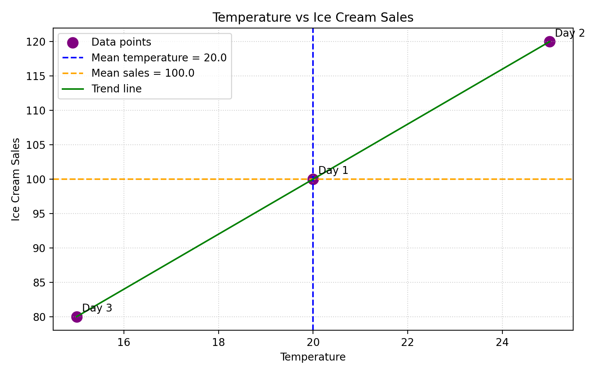

# Covariance and Correlation Lab

This project demonstrates how to calculate and interpret covariance and the correlation coefficient using temperature and ice cream sales.

## Learning Objectives
By the end of this exercise, learners will be able to:
- Calculate covariance and correlation to understand the direction and strength of relationships.
- Interpret the relationship between two variables using covariance and correlation coefficient.
- Explain the significance of positive and negative correlations in context.
- Evaluate findings through a visual representation to determine the strength and direction of the relationship.

## Lab Overview
This lab shows how to calculate and interpret covariance and correlation coefficients to understand relationships between variables.

By examining temperature and ice cream sales, we:
- Calculate means for both variables.
- Compute covariance to measure the direction of the relationship.
- Calculate standard deviations for both variables.
- Derive the correlation coefficient.
- Use a scatter plot and trend line to visually confirm the relationship.

## Scenario
We want to understand the relationship between two variables:
- **Temperature (X):** As the temperature rises, people are more likely to buy ice cream.
- **Ice Cream Sales (Y):** Higher ice cream sales are expected on hotter days.

This is a positive relationship because both variables move in the same direction.

## Dataset
Daily temperature and ice cream sales for three days:

- Day 1: Temperature = `20`, Ice Cream Sales = `100`
- Day 2: Temperature = `25`, Ice Cream Sales = `120`
- Day 3: Temperature = `15`, Ice Cream Sales = `80`

## Step 1: Calculate the Means (Averages)
- Mean temperature: `(20 + 25 + 15) / 3 = 60 / 3 = 20`
- Mean ice cream sales: `(100 + 120 + 80) / 3 = 300 / 3 = 100`

## Step 2: Calculate Deviations from the Mean of X and Y
### Temperature Deviations
- Day 1: `20 - 20 = 0`
- Day 2: `25 - 20 = 5`
- Day 3: `15 - 20 = -5`

### Ice Cream Sales Deviations
- Day 1: `100 - 100 = 0`
- Day 2: `120 - 100 = 20`
- Day 3: `80 - 100 = -20`

## Step 3: Multiply Deviations and Calculate Covariance of X and Y
- Day 1: `0 × 0 = 0`
- Day 2: `5 × 20 = 100`
- Day 3: `-5 × -20 = 100`

Sum of products:
- `0 + 100 + 100 = 200`

Covariance:
- `200 / 3 = 66.66666666666667`

The positive covariance shows that as temperature increases, ice cream sales also increase.

## Step 4: Calculate the Correlation Coefficient
To calculate correlation, we first find the standard deviation for each variable.

### 4.1 Square Each Deviation
#### Temperature Deviations Squared
- `0² = 0`
- `5² = 25`
- `(-5)² = 25`

#### Ice Cream Sales Deviations Squared
- `0² = 0`
- `20² = 400`
- `(-20)² = 400`

### 4.2 Calculate the Mean of the Squared Deviations
#### Temperature Variance
- `(0 + 25 + 25) / 3 = 50 / 3 = 16.666666666666668`

#### Ice Cream Sales Variance
- `(0 + 400 + 400) / 3 = 800 / 3 = 266.6666666666667`

### 4.3 Take the Square Root of the Variance to Get the Standard Deviation
- Temperature standard deviation: `√16.666666666666668 = 4.08248290463863`
- Ice cream sales standard deviation: `√266.6666666666667 = 16.32993161855452`

### 4.4 Add Values to the Correlation Coefficient Formula
- `r = covariance / (σx × σy)`
- `r = 66.66666666666667 / (4.08248290463863 × 16.32993161855452)`
- `r = 1.0`

## Calculation Result
The correlation coefficient is **1.0**, which is a perfect positive correlation.

This means:
- As temperature increases, ice cream sales increase.
- The two variables move in the same direction.
- The relationship is extremely strong and positive.

## Positive vs Negative Correlation
- **Positive correlation:** Both variables increase or decrease together.
- **Negative correlation:** One variable increases while the other decreases.
- **Zero correlation:** No linear relationship between the variables.

In this lab, temperature and ice cream sales show a **positive correlation**.

## Visualization
The file `temperature_icecream_plot.png` shows:
- The data points for temperature and ice cream sales
- A trend line
- Mean temperature as a dashed vertical line
- Mean sales as a dashed horizontal line

The graph visually confirms the strong positive relationship.



## Project Files
- `covariance_correlation.py` — Python script with comments that calculates covariance, standard deviations, and correlation coefficient
- `temperature_icecream_plot.png` — visualization of the relationship
- `newfile.txt` — original tracked file from the repo history

## How to Run
1. Create a virtual environment and install the plotting library:
```bash
python3 -m venv .venv
.venv/bin/pip install matplotlib
```

2. Run the program:
```bash
.venv/bin/python covariance_correlation.py
```

## Expected Output
```text
Covariance and Correlation Lab
Temperature data: [20, 25, 15]
Ice cream sales data: [100, 120, 80]
Mean temperature: 20.0
Mean ice cream sales: 100.0
Temperature deviations: [0.0, 5.0, -5.0]
Sales deviations: [0.0, 20.0, -20.0]
Products of deviations: [0.0, 100.0, 100.0]
Covariance: 66.66666666666667
Temperature squared deviations: [0.0, 25.0, 25.0]
Sales squared deviations: [0.0, 400.0, 400.0]
Temperature variance: 16.666666666666668
Sales variance: 266.6666666666667
Temperature standard deviation: 4.08248290463863
Sales standard deviation: 16.32993161855452
Correlation coefficient: 1.0
Plot saved as temperature_icecream_plot.png
```
